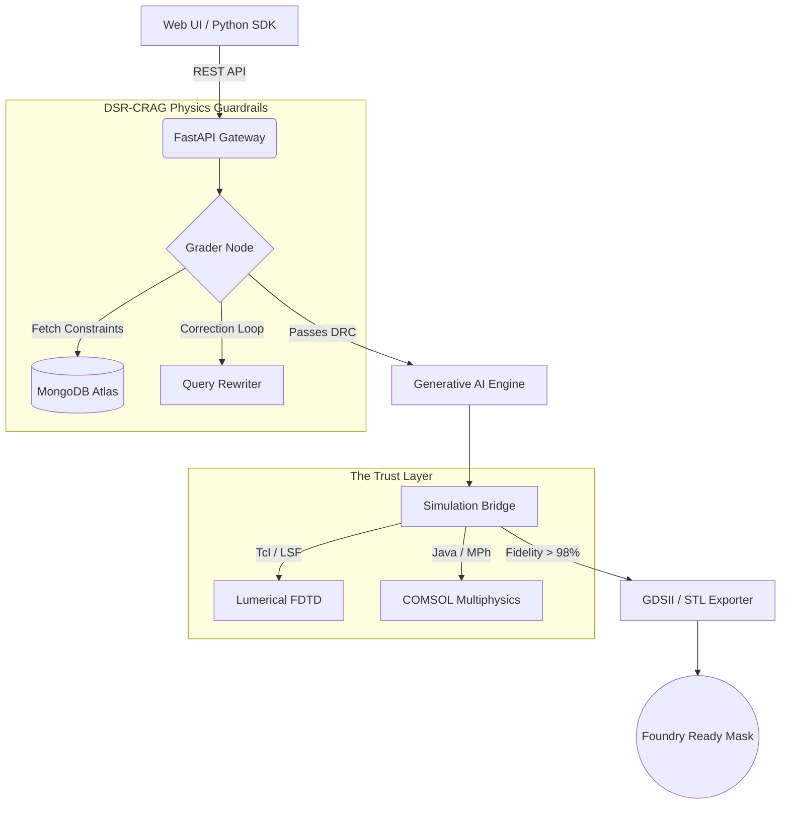

# ⚡ Precision with Light: Enterprise Photonics Platform


**Precision with Light** is a vertically integrated, AI-driven CAD platform for Silicon Photonics and Microstructured Optical Fibers. 

Unlike standard Generative AI, this platform utilizes a **DSR-CRAG (Dual-State Corrective Retrieval-Augmented Generation)** architecture. This ensures that every AI-synthesized geometry strictly adheres to hard physical constraints and CMOS foundry Design Rule Checks (DRCs) before a single simulation is run.

## 🏗️ System Architecture

The platform operates as a Monorepo, bridging a modern web frontend with a high-performance Python physics engine.



 ## Repository Structure - Monorepo
 
```Bash
Precision-with-Light-Platform/
├── backend/                 # Core Python Engine & FastAPI
│   ├── 1_intent_layer/      # RAG, LLM Parsers, Pydantic Schemas
│   ├── 2_generative_engine/ # PyTorch AI Models
│   ├── 3_simulation_bridge/ # Solver Automations (Lumerical/COMSOL)
│   ├── 4_fabrication_export/# GDSII & STL mask generation
│   └── api/                 # Gateway endpoints (gateway_v2.py)
├── frontend/                # React/TypeScript Web IDE (Lovable.dev)
├── sdk/                     # Official Python Client SDK
└── docker-compose.yml       # 1-Click Environment Orchestration
```


## 🚀 Quick Start (Docker Deployment) 

We use Docker to ensure zero-friction deployment. You do not need to configure local Python paths or database instances.

 1.Clone the repository:
```Bash
git clone [https://github.com/nunofernandes-plight/Precision-with-Light-Photonics-Platform.git](https://github.com/nunofernandes-plight/Precision-with-Light-Photonics-Platform.git)
cd Precision-with-Light-Photonics-Platform
```

 2. Set up environment variables:
```Bash
cp .env.example .env
# Edit .env with your MongoDB URI and Solver Paths
```
 3. Spin up the platform:
```Bash
docker-compose up -d --build
```

The Backend API will be available at http://localhost:8000/docs.

The Frontend UI will be available at http://localhost:3000.


# 🛣️ Platform Roadmap

Phase 1 (Current): Foundation & Reliability (DSR-CRAG, Lumerical/COMSOL Bridge).

Phase 2 (Q3 2026): Active Components (Modulators) & Metasurface Generation.

Phase 3 (H1 2027): Multi-Project Wafer (MPW) Batch Endpoints & Multi-GPU Inference.

Phase 4 (2027+): Autonomous System-Level PIC Synthesis.


LICENSE: 
   Apache License
                           Version 2.0, January 2004
                        http://www.apache.org/licenses/

